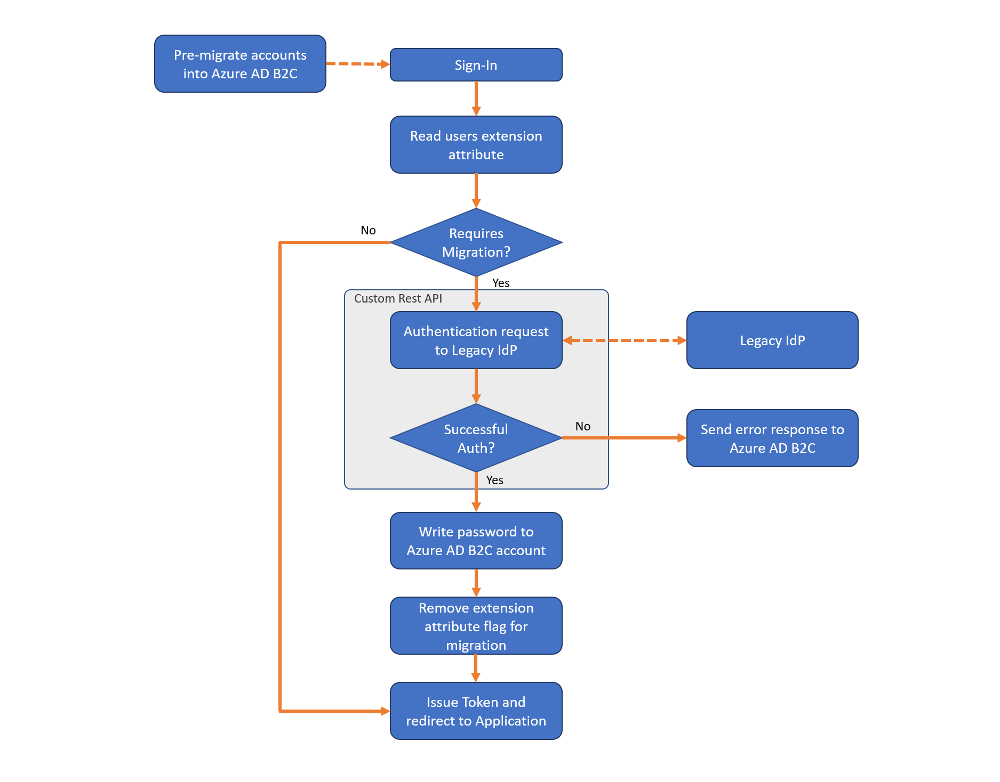

# AzureB2C_UserMigration
Seamless user migration from Database to AzureB2C

References
1. https://learn.microsoft.com/en-us/azure/active-directory-b2c/user-migration
2. https://learn.microsoft.com/en-us/azure/active-directory-b2c/custom-policy-overview
3. https://learn.microsoft.com/en-us/azure/active-directory-b2c/tutorial-create-user-flows?pivots=b2c-custom-policy
4. https://github.com/Azure-Samples/active-directory-b2c-custom-policy-starterpack
5. https://github.com/azure-ad-b2c/user-migration/tree/master/seamless-account-migration
6. https://learn.microsoft.com/en-us/azure/active-directory-b2c/restful-technical-profile

 
Stages of User Migration
1)	Pre-Migration: Migrate existing users to AzureB2C with a default password and the “Require Migration” flag set to true.
2)	When the user logs in, the username and password entered are validated against the legacy identity provider if the “Require migration” flag is set to true. On successful validation, the password entered by the user is updated in the AzureB2C account, and the “Require migration” flag is set to false.
3)	Any login attempt by the user after the initial login validates the user credentials with AzureB2C.



Setup Process 

1) Create a user attribute “requiresMigration” using Graph API 
   - Register an Application for User Migration in AzureB2C
     
     - Create a new application 
     - For Name, use B2CUserMigration. 
     - For Supported account types, use Accounts in this organizational directory only. 
     - For Redirect URI, use type Web: https://localhost (it's not relevant for this application). 
     - Click Register 
   - Create a Client Secret
     
     
     - Click on Certificates and Secrets menu and add a new key (also known as client secret). Copy the key for later. 
     - Key name: client-secret 
       

   - GET AccessToken to invoke MicrosoftGraph API 
     - POST - https://login.microsoftonline.com/yourtenant.onmicrosoft.com/oauth2/token 
     - BODY: x-www-form-urlencoded 
     - grant_type = client_credentials 
     - client_id = \<\<Application Id of B2CUserMigration\>\> 
     - client_secret=\<\<Client Secret Key created for B2CUserMigration Application\>\> 
     - Resource= https://graph.microsoft.com 
       
  
   - Create User Attribute “requiresMigration” using Graph API 
     - POST - https://graph.microsoft.com/v1.0/applications/\<\<b2c-extensions-app Application ObjectId\>\>/extensionProperties 
     - b2c-extensions-app is a default application in App registrations “b2c-extensions-app. Do not modify. Used by AADB2C for storing user data” 
       
     - On the Request Header, copy paste the access_token generated above. 
       
     - Payload to create the user attribute: <br/>
       ```diff
       {  
       "name": "requiresMigration",  
       "dataType": "Boolean",  
       "targetObjects": ["User"]
       }
      

    - Grant administrative permission to your application 
      - Click on API permissions. 
      - Click on Add a Permission -> Microsoft Graph. 
      - Select Application Permissions, select the Directory.ReadWrite.All and Application.ReadWrite.All permissions and click Save. 
      - Finally, back in the Application Permissions menu, click on the Grant admin Consent button. 
        
      

 2) Pre-Migration Step: Migrating Existing User 
    - Use the attribute name “extension_975********************_requiresMigration” 	while migrating users to AzureB2C using Graph API. 
    - POST - https://graph.microsoft.com/v1.0/users 
    - On the Request Header, copy paste the access_token generated above. 
      
    - Payload to create the user: 
      <<Use the user attribute generated - extension_975********************_requiresMigration>>
      ```diff
      { 
       "displayName": "TestFN TestLN", 
       "identities": [ 
         { 
           "signInType": "emailAddress", 
           "issuer": "yourtenant.onmicrosoft.com", 
           "issuerAssignedId": "test@email.com" 
         } 
       ], 
       "passwordProfile" : { 
         "password": <<TempPassword>>, 
         "forceChangePasswordNextSignIn": false 
       }, 
       "passwordPolicies": "DisablePasswordExpiration", 
       "extension_975********************_requiresMigration": true 
      }
     

 3) Register Custom Policy Applications 
  - Create Signing Key – TokenSigningKeyContainer – Key Type: RSA – Key Usage: Signature 
  - Create Encryption Key – TokenEncryptionKeyContainer – Key Type: RSA – Key Usage: Encryption 
  - Register two applications,  
    - IdentityExperienceFramework, a web API. 
    - ProxyIdentityExperienceFramework, a native app with delegated permission to the IdentityExperienceFramework app. 
    - You need to register these two applications in your Azure AD B2C tenant only once. 
      
      
      

      

 4) How Custom Policy works?
    
    
    - A Base file that contains most of the definitions. To help with troubleshooting and long-term maintenance of your policies, try to minimize the number of changes       you make to this file. 
    - A Localization file that holds the localization strings. This policy file is derived from the Base file. Use this file to accommodate different languages to suit       your customer needs. 
    - An Extensions file that holds the unique configuration changes for your tenant. This policy file is derived from the Localization file. Use this file to add new       functionality or override existing functionality. For example, use this file to federate with new identity providers. 
    - A Relying Party (RP) file that is the single task-focused file that is invoked directly by the relying party application, such as your web, mobile, or desktop         applications. Each unique task, such as sign-up, sign-in, or profile edit, requires its own relying party policy file. This policy file is derived from the             extensions file. 
    - The inheritance model is as follows: 
      - The child policy at any level can inherit from the parent policy and extend it by adding new elements. 
      - For more complex scenarios, you can add more inheritance levels (up to 10 in total). 
      - You can add more relying party policies. For example, delete my account, change a phone number, SAML relying party policy and more.
      
 5) Custom Policy Starter Pack 
    https://github.com/Azure-Samples/active-directory-b2c-custom-policy-starterpack 
    - Azure AD B2C custom policy starter pack comes with several pre-built policies to get you started quickly. Each of these starter packs contains the smallest       
      number of technical profiles and user journeys needed to achieve the scenarios described: 
      - LocalAccounts - Enables the use of local accounts only. 
      - SocialAccounts - Enables the use of social (or federated) accounts only. 
      - SocialAndLocalAccounts - Enables the use of both local and social accounts. Most of our samples refer to this policy. 
      - SocialAndLocalAccountsWithMFA - Enables social, local, and multi-factor authentication options. 

    - Refer to https://github.com/jeevanram/AzureB2C_UserMigration/tree/main/CustomPolicies for Custom policies(XMLs) used in Seamless user migration with legacy
      identity provider rest API 
